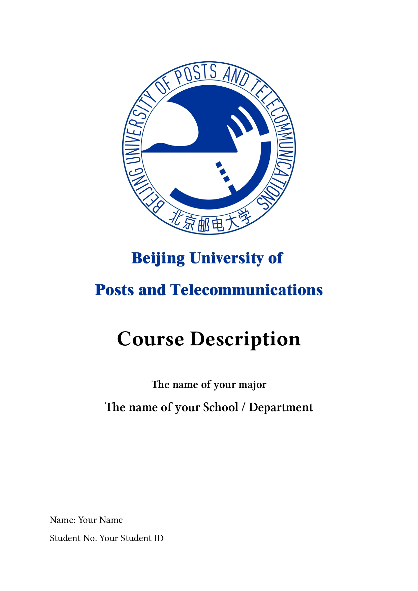
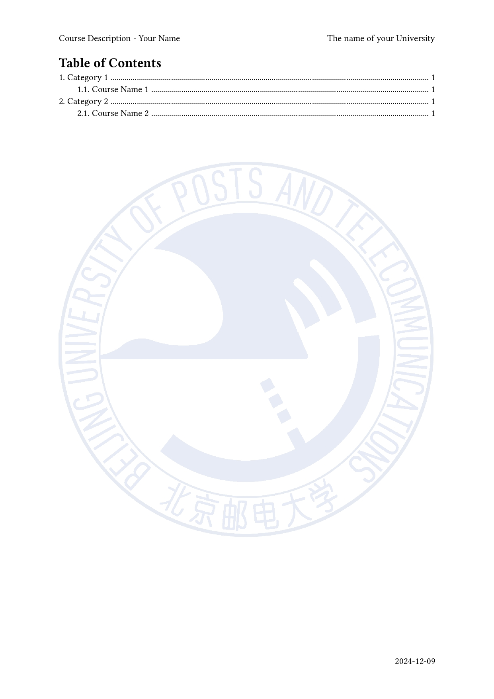
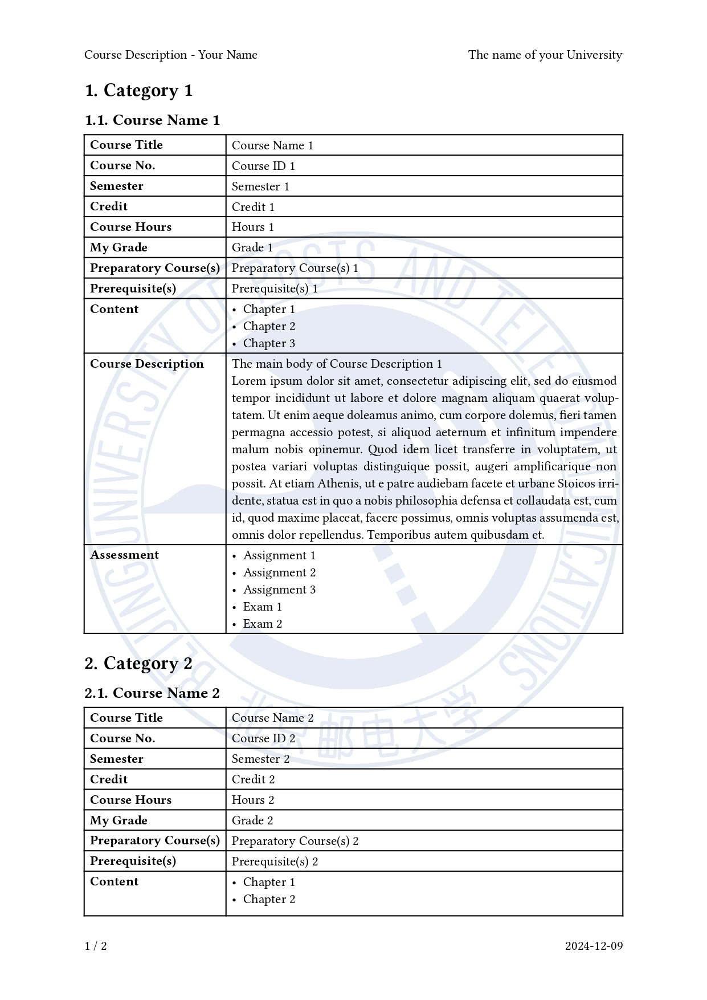
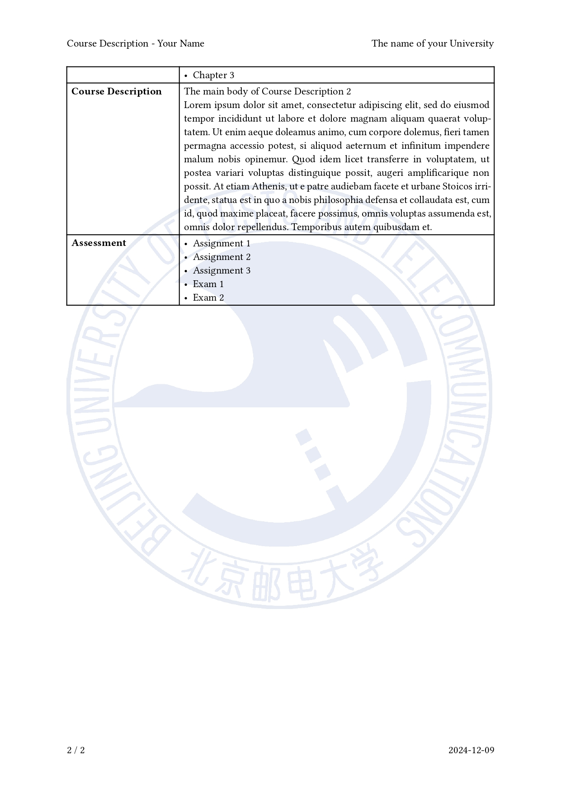

# BUPT Course Description Template

This repository contains a template for creating Course Description using [Typst](https://typst.app/). It is designed to assist in generating clear and professional course summaries, especially useful for students at BUPT who need to present course details in a standardized and visually appealing format when applying to universities.

```diff
- 注意：
- 教务处对于专业英文名的要求是按照在读证明上官方的称呼（例如 Bachelor of Engineering in Computer Science and Technology），或者可以按照教务给的封面模板不写专业英文名；
- 对于除 Course Description 字段以外不包含在教务处给的课程描述素材包中的内容教务处不予对正文内容进行盖章，但允许给封面盖章。
```

## Preview

|  |  |
| ---------------------------------------------- | ---------------------------------------------- |
|  |  |

## Usage

In the `main.typ` file, you just need to fill in the information of your university, major, school, name, student ID, and the details of each course. The template will automatically generate a PDF file with the course descriptions.

### Metadata

Please begin your `main.typ` file with the following metadata:

```typst
#import "template.typ": template, course

#show: template.with(
  university: "The name of your University",
  major: "The name of your major",
  school: "The name of your School / Department",
  name: "Your Name",
  id: "Your Student ID",
  // The cover image settings
  cover: (
    logo_path: "logo_bupt2.png",
    logo_width: 100%,
    logo_with_university_name: true,
  ),
  // The watermark image settings as the background of the document
  watermark: (
    img_path: "logo_bupt_translucent.png",
    img_width: 160mm,
  ),
)
```

### Course Categories

Just use `= Course Category Name` to create a new category. For example, if you want to create a category named 'Major Courses', you can write

```typst

= Major Courses

#course(...)

#course(...)

```

### Course Description Items

The `#course` function's parameters are all named parameters. If you don't want to fill in some of the parameters, you can just don't use them. For example, if you don't need 'Pre-requisites', you can just write

```typst
#course(
  name: [Course Name 1],
  id: [Course ID 1],
  semester: [Semester 1],
  credit: [Credit 1],
  hours: [Hours 1],
  grade: [Grade 1],
  preparatory: [Preparatory Course(s) 1],
  content: [
    - Chapter 1
    - Chapter 2
    - Chapter 3
  ],
  description: [
    The main body of Course Description 1 \
    #lorem(100)
  ],
  assessment: [
    - Assignment 1
    - Assignment 2
    - Assignment 3
    - Exam 1
    - Exam 2
  ],
)
```

and the 'Pre-requisites' part will not be shown in this course description table.
